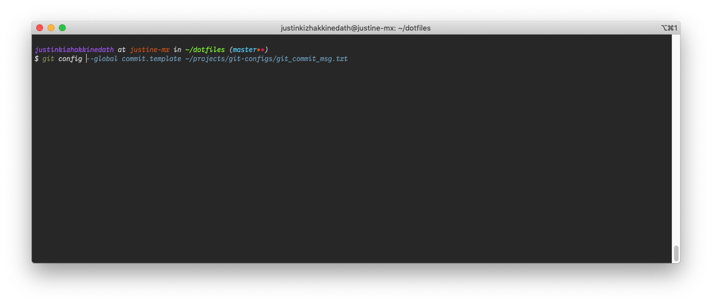

[](https://github.com/hlissner/doom-emacs)
[](https://www.instagram.com/alka1e)
[](https://twitter.com/alka1e)

# My Dotfiles

[]()

# Features

Dotfiles are managed using [chezmoi](https://www.chezmoi.io)

Contains settings for:

- Zsh

# Installation

- Install brew and add to path
    
    `/bin/bash -c "$(curl -fsSL https://raw.githubusercontent.com/Homebrew/install/HEAD/install.sh)"`
    
    ```
    echo 'eval "$(/opt/homebrew/bin/brew shellenv)"' >> /Users/justinekizhak/.zprofile
    eval "$(/opt/homebrew/bin/brew shellenv)"
    ```
- `brew install chezmoi`
- `chezmoi init --apply justinekizhak/dotfiles-next`

All the packages will be installed by the run_once script.

The installation may fail because of bitwarden vault not being unlocked.

To unlock the vault run: 

```
bwu
```

This should unlock the vault if locked and syncs the vault.

## Bitwarden item requirements

1. Item name: `GPG agent`
2. Fields:
    1. `FullName`
    2. `Email`
    3. `SigningKey`
3. Attachements:
    1. `gpg_secret.key`

## Instruction on setting up GPG signing

https://gist.github.com/troyfontaine/18c9146295168ee9ca2b30c00bd1b41e

# Screenshots

### ZSH shell



# License

Licensed under the terms of [MIT License](LICENSE.md)

---

[](https://forthebadge.com)
[](https://forthebadge.com)
[](https://forthebadge.com)
