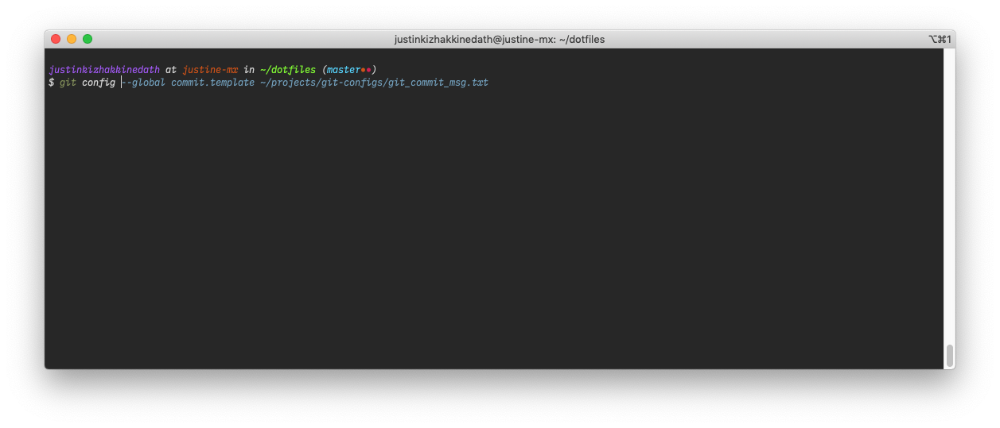

# ZSH Config

# Packages

-   Zim framework

# Screenshots

## `custom_functions.sh`

The custom functions you want to run from your shell directly

## `keybindings.sh`

Keybinds you use within the shell

## `zimrc.sh`

Config file for the ZIM framework

## `zlogin.sh`

Configs which are run when starting the shell

## `zshenv.sh`

All the environment variables and all the folders in the path

## `zshrc.sh`

Main zsh config file. All the custom settings.

## `zshrc_manager.sh`

Main entry point for the zsh configs. It loads `custom_functions.sh`,
`keybindings.s` and the `zshrc.sh`.
